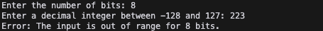
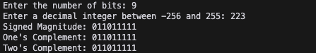
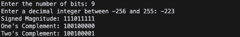
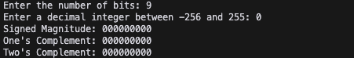

# Output show cases
รายงานนี้แสดงผลลัพธ์การทำงานของโปรแกรมแปลงเลขฐานสิบเป็นเลขฐานสองในรูปแบบต่างๆ โดยแบ่งการทดสอบออกเป็น 4 กรณีหลัก

## Case1: Out of range input
เมื่อผู้ใช้ป้อนตัวเลขที่เกินขอบเขตของจำนวนบิตที่กำหนด โปรแกรมจะแสดงข้อความแจ้งเตือนความผิดพลาด

## Case2: Positive Number
การแปลงเลขฐานสิบที่เป็นจำนวนบวกไปเป็นเลขฐานสอง แสดงผลทั้ง 3 รูปแบบ:

## Case3: Negative Number
การแปลงเลขฐานสิบที่เป็นจำนวนลบไปเป็นเลขฐานสอง แสดงผลทั้ง 3 รูปแบบ:

## Case4: Zero
การแปลงเลข 0 ไปเป็นเลขฐานสอง ทั้ง 3 รูปแบบจะให้ผลลัพธ์เหมือนกันคือเป็นเลขศูนย์ทั้งหมด

